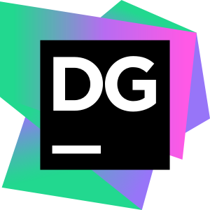

<h1 align="left" id="zztrk-title">:wave: Hello there! I'm Emrah Öztürk</h1>
<h3 align="left">I am a person who is curious about how things work, researchers, tried and believes in continuous improvement to see how I can do better.</h3>

   

- :seedling: &nbsp;I’m currently learning **Go**
- :speech_balloon: &nbsp;I'm a big **Beşiktaş** fan
- :mailbox: &nbsp;Ask me anything on my **[issues page]**
- :computer: &nbsp;Connect with me on **[LinkedIn]**

 

<h2 align="left" id="zztrk-tech">Favorite Tech</h2>

> Tools, languages, and other things that I like to work with.

<table>
  <tr>
    <td align="center" width="96">
      
       C#&nbsp;(Core)
    </td>
    <td align="center" width="96">
      
       Go
    </td>
    <td align="center" width="96">
      
       TypeScript
    </td>
    <td align="center" width="96">
      
       JavaScript
    </td>
    <td align="center" width="96">
      
       React
    </td>
    <td align="center" width="96">
      
       Rider
    </td>
        <td align="center" width="96">
      
       Datagrip
    </td>
  </tr>
  <tr>
    <td align="center" width="96"> 
      
       Docker
    </td>
    <td align="center" width="96">
      
       Kubernetes
    </td>
    <td align="center" width="96">
      
       Powershell
    </td>
    <td align="center"  width="96">
      
       MSSQL
    </td>
       <td align="center"  width="96">
      
       PostgreSQL
    </td>
        </td>
       <td align="center"  width="96">
      
       MongoDB
    </td>
      </td>
        </td>
       <td align="center"  width="96">
      
       Elastic Stack
    </td>
  </tr>
</table>

<!-- links -->

[issues page]: https://github.com/zztrk/zztrk/issues "zztrk/issues"
[linkedin]: https://www.linkedin.com/in/zztrk/ "Emrah Öztürk LinkedIn"
